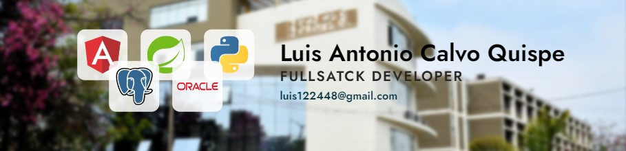

<h1 align="center">Hola, soy <a href="https://luis122448.com/">luis122448</a></h1>

## Sobre mi

- Ingeniero Industrial con 2 años de experiencia en el desarrollo de aplicaciones web y administración de base de datos.
- Desarrollo de aplicaciones web con Angular y Java (Spring Boot)
- Administrador de Base de Datos Oracle (19c) y programador PL/SQL
- Desarrollo y administracion de ETL (Oracle, Mysql) con Python ( FASTAPI ) y Oracle Instant Client
- Elaboracion de reportes con JasperReports

## Proyectos
<table>
<tr>
<td width="50%">
<h3 align="center">Smart Shell</h3>

- Emisión, busqueda e impresión de comprobantes electrónicos.
- Mantenimiento de artículos, clientes, vendedores y tipo de cambio.
- Importación y exportación masiva de articulos y lista de precios.
- Subida, descarga y control de archivos (pdf, images, zip) adjuntos.
- Authentication y autorización de usuarios con roles y permisos.

                                                                                 
</td>
<td width="50%">
                
<h3 align="center">Platform Traning</h3>

                                       

 

- Modulos, cursos y clases personalizables por usuario.
- Seguimiento y control de la asistencia y participacion.
- Examenes, Quiz y control de academico.
- Sistema de certificacion y verificacion.

                                                             
</table>                                                                                 

                                                 

 

### ⚙️ &nbsp;GitHub Analytics

